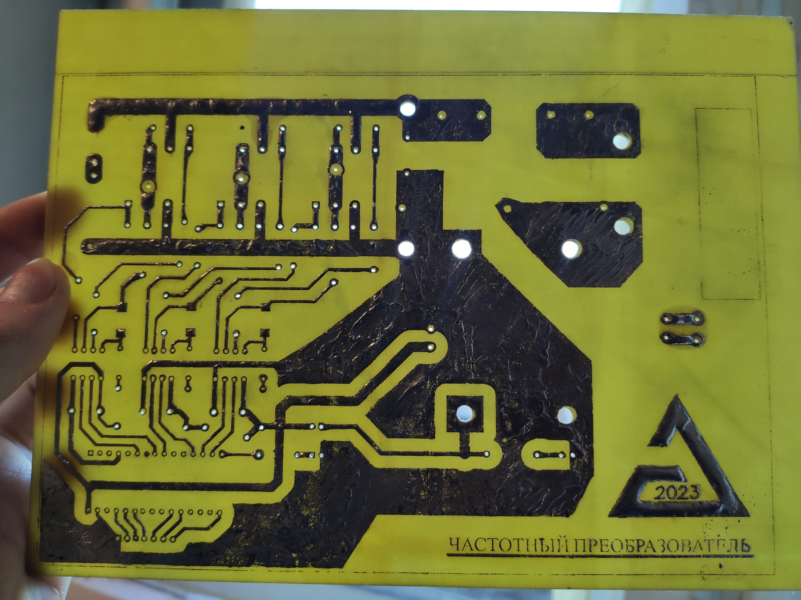
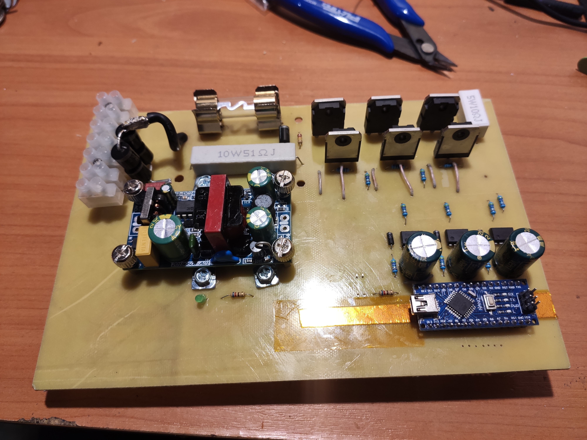
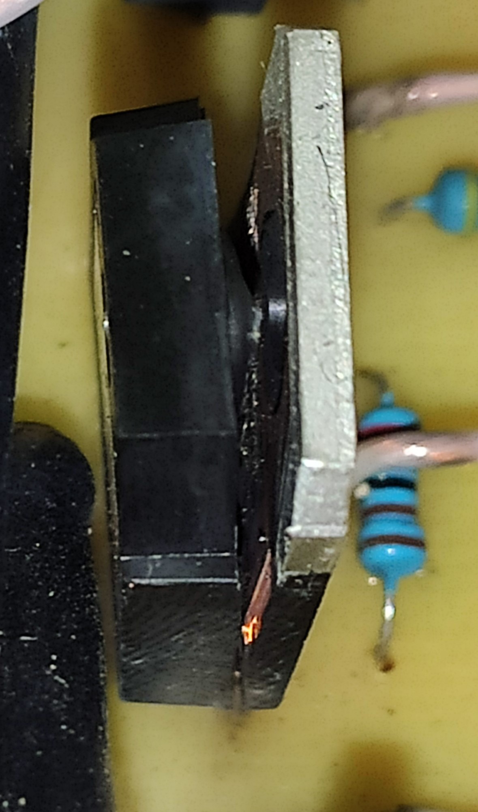
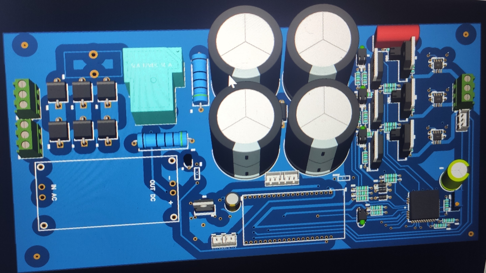
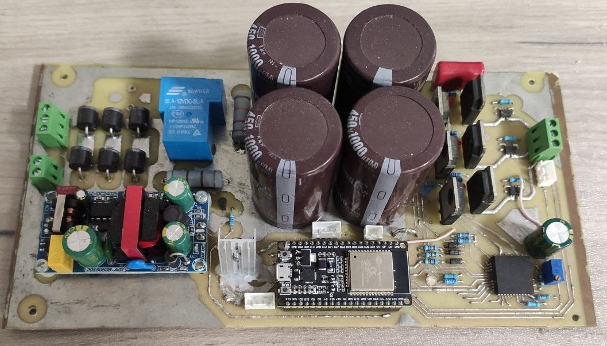
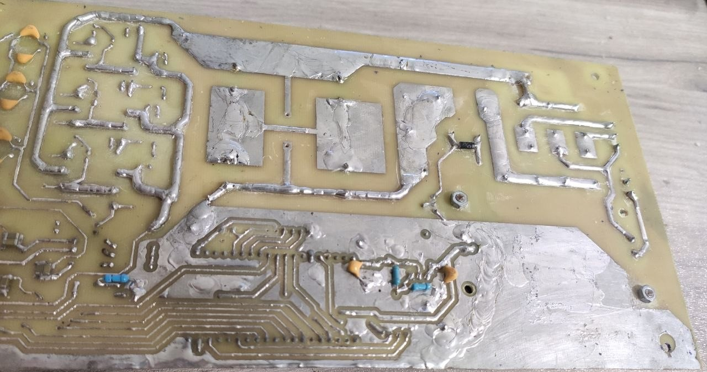
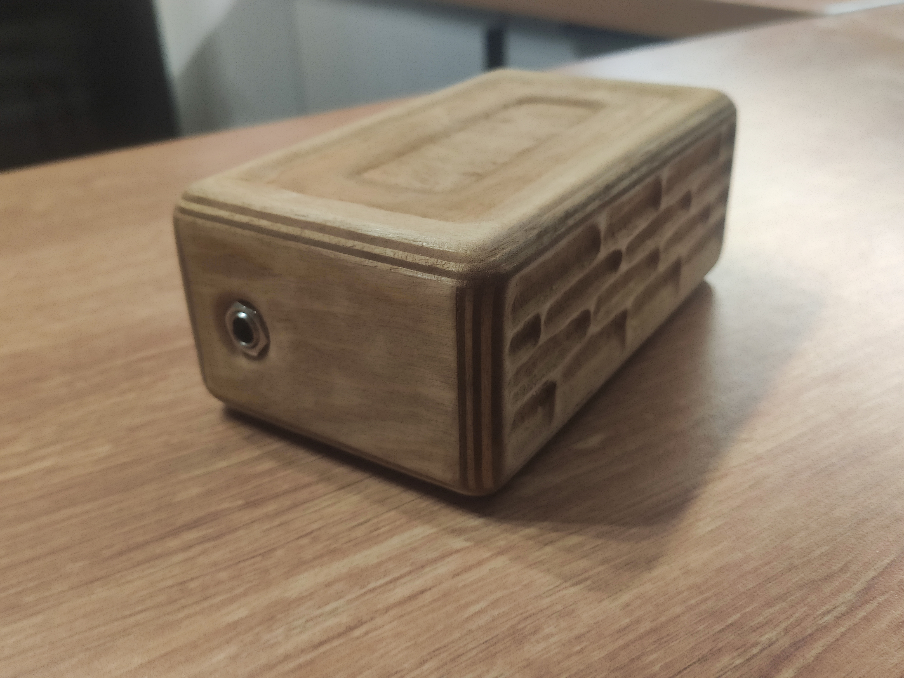
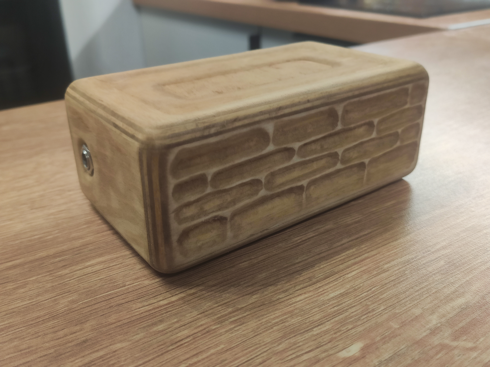

# ПОРТФОЛИО
## Болтенков Степан Фёдорович

**Инженер-разработчик | Встраиваемые системы · Электропривод · Силовая электроника**

Email: boltikststepan@gmail.com · Telegram: @devex41 · github.com/devex41

---

## Образование

**СПбГЭТУ «ЛЭТИ»** — Магистратура, 2025–2027    
27.04.04 «Управление в технических системах»
Программа: «Автоматизация и управление производственными комплексами и подвижными объектами»

**ВШТЭ СПбГУПТД** — Бакалавриат, 2021-2025  
15.03.04 «Автоматизация технологических процессов и производств»

---

## Направления

Встраиваемые системы · Электропривод · Силовая электроника · Разработка РЭА · АСУТП

---

## Опыт работы

**Лаборант кафедры автоматизации** · ВШТЭ СПбГУПТД · 1.5 года, 2024–2025

— Разработка и изготовление лабораторного оборудования (проекты №4 и №6 ниже)   
— Расчёты и моделирование содорегенерационного котлоагрегата в Matlab/Simulink 

---

## Стек

**МК и прошивки**: ESP32, ATmega328p, C/C++, FreeRTOS, ESP-IDF, PlatformIO, Arduino  
**Силовая электроника:** IGBT, MOSFET, силовые преобразователи, векторное управление СДПМ  
**Схемотехника и PCB:** Altium Designer, EasyEDA, аналоговая и цифровая схемотехника  
**Интерфейсы:** SPI, UART, I²C, DMA, Wi-Fi, Bluetooth, PWM (PPM)   
**АСУТП:** TIA Portal/Simatic Manager/Codesys (учебный уровень), Python SCADA  
**Измерения и отладка:** осциллограф, логический анализатор, мультиметр, токовые клещи  
**CAD / CAM:** Компас 3D, AutoCAD 2D (учебный уровень), Cura (FDM-печать), LightBurn (лазерные станки)  
**Моделирование:**	  Matlab/Simulink (анализ САУ, синтез регуляторов), Ansys Maxwell (базовый уровень)  

---

## Проекты

### Проект 1 — Гибридный электропривод

*~12 месяцев · Бакалаврская ВКР*
Разработка системы управления гибридной силовой установкой (параллельный гибрид, СДПМ в роли стартер-генератора мотоцикла) и изготовление опытного образца электродвигателя с нуля.

**Что сделано:**
- Разработал собственный векторный контроллер СДПМ: схемотехника готова полностью, топология платы и прошивка на ESP32 на этапе доработки
- Спроектировал и изготовил опытный образец электродвигателя в металле и оборудование для него

**Стек:** ESP32, C/C++, FreeRTOS, IGBT, Altium Designer, Simulink, векторное управление (FOC)

<strong>Фото</strong>

Двигатель

Сборка двигателя в компасе:

Моделирование в Ansys:

.png>)

Пластиковый макет и опытный образец в металле:

Резка статорного и роторного железа на лазере:

.png>)

Проточка корпуса:

Статорная пластина:

.png>)

Статор в сборе:

Обмотка:

Ротор после проточки:

Отливка для задней крышки:

.png>)

Перед первым пуском с небольшим ESC:

ЭДС двигателя:

Замеры пускового момента через вес и длину плеча:

.png>)

Контроллер

Режимы ГСУ: 

 

Структурная схема контроллера:  

 

Техническая структура контроллера:  

 

Фрагмент схемы контроллера ГСУ: 

 

Имитационная модель ГСУ в Simulink:    

 

Структура ЗУ контроллера:   

 

Ограничитель момента:   

 

Упрощённая кинематика:  

 

---

### Проект 2 — Лазерный CO₂ ЧПУ-станок 100 Вт
*В рамках проекта гибридного привода — для резки электротехнической стали*

Разработан с нуля под конкретную задачу производства ротора и статора электродвигателя.

**Что сделано:**
- Рама из алюминиевого профиля, редукторы, настроена оптика с лазерной трубой 100 Вт
- Контроллер MKS, лазерный БП и чиллер Cloudray, формирование GCode в LightBurn
- Сборка и пусконаладка электроники, механики и оптики

**Стек:** ЧПУ (CNC), LightBurn, MKS, шаговый двигатель, CO₂ лазер

<strong>Фото</strong>

Контроллер станка:

Дисплей контроллера:

Первый тест на углеродистой стали ~0.3мм:

Резка статорного и роторного железа на лазере:

.png>)

Тесты резки и гравировки дерева:

.png>)

Отдельный микропроект ЧПУ фрезера для печатных плат за вечер:

---

### Проект 3 — Контроллер муфельной печи 10 кВт
*В рамках проекта гибридного привода — для литья корпусных деталей*

**Что сделано:**
- Управление нагревом по постоянке через IGBT, релейная защита
- Термопара S-типа (платино-родиевая) + неинвертирующий ОУ, диапазон до 1300 °C, спираль фехраль
- Интерфейс: энкодер + 7-сегментные индикаторы

**Стек:** ESP32, PWM, I2C, ADC, C/C++, ОУ, IGBT, термопара S-типа

<strong>Фото</strong>

Изометрия муфельной печи:

Контроллер печи:

Первая прокалка печи:

.png>)

Плавка алюминия для отливки корпуса двигателя:

.png>) 

---

### Проект 4 — Измерительный прибор для калориметрических опытов
*~2 месяца*

Замена ртутного термометра Бекмана в лабораторном калориметре на цифровой прибор с точностью ~0,04 °C при диапазоне измерения 20 °C.

**Что сделано:**
- Разработал аналоговый тракт: датчик PT100, инструментальный усилитель на трёх ОУ
- Два интерфейса пользователя: цветной TFT-дисплей и веб-страница по WiFi
- Управление ёмкостными кнопками (металлические контакты на входах МК)

**Стек:** ESP32, C++, PT100, WiFi, SPI, ADC, аналоговая схемотехника, EasyEDA

<strong>Фото</strong>

Плата в EasyEDA:

Протравленная плата на датчике:

Начинка прибора:

Примерка корпуса:

Емкостные кнопки:

 

Законченный прибор:

 

---

### Проект 5 — Лазерный дальномер: реверс-инжиниринг и интеграция
*~2–3 месяца*

Превращение заводского фазового дальномера в автономный датчик без какой-либо документации на электронику устройства.

**Что сделано:**
- Подключил ESP32 к контактам дисплея ST7732 (SPI подобный) вместо штатного экрана для перехвата данных в бинарном формате
- Вручную определил кодировку: параллельное считывание показаний глазами и запись hex-дампов логическим анализатором
- Эмулировал кнопки управления оптронами для управления и поддержания прибора в рабочем режиме

**Стек:** ESP32, C/C++, реверс-инжиниринг, логический анализатор, SPI

<strong>Фото</strong>

Определение рабочих контактов у дисплея:

Декодирование и анализ сигналов логическим анализатором:

.png>) 

.png>)

Ручное определение нестандартной кодировки и протокола:

.png>) 

.png>)

Результат работы - правильная прослушка тракта МК-дисплей.

.png>)

Данные на дисплее прибора и компьютере совпадают:

.png>) 

---

### Проект 6 — Контроллер насосов со SCADA
*~2 недели*

Контроллер управления тремя 12В насосами с ШИМ-регулированием и Python SCADA-система с GUI для лабораторных опытов.

**Что сделано:**
- Контроллер на Arduino Nano: ШИМ через MOSFET с общим истоком
- SCADA на Python: управление производительностью и соотношением насосов, графический интерфейс

**Стек:** Arduino Nano (ATmega328p), MOSFET, Python (GUI), PWM, UART

<strong>Фото</strong>

Контроллер:

 

SCADA:

.png>)

---

### Проект 7 — Частотный преобразователь (скалярный и векторный)

Разработка ЧП с нуля в двух итерациях — от скалярного управления до векторного.

**Что сделано:**
- **Итерация 1 (скалярный U/f=const):** модифицированный синус с 3й гармоникой, схема и плата с нуля, изготовление методом фоторезиста. ATmega328p, IGBT 600 В, полумостовые драйверы FAN7382, управление энкодером, I²C дисплей. Полностью рабочий
- **Итерация 2 (векторный):** ESP32, 3-фазный драйвер IR2233J, датчики тока ACS712 (эффект Холла). Плата готова, прошивка на этапе отладки

**Стек:** ATmega328p, ESP32, C++, I2C, SPI, IGBT, FOC, EasyEDA, Altium Designer

<strong>Фото</strong>

Первый опыт создания однослойной печатной платы:

Скалярный частотник в сборе (без силового электролита):

Пополнение на кладбище IGBT или первые шаги в силовой электронике:

Успешные тесты на BLDC (в дальнейшем на асинхроннике):

.png>)

"Несинусоидальный синус" или THD=+100500, модулируемый сигнал - синус с 3й гармоникой:

.png>)

3D модель платы векторного частотника в EasyEDA:

 

Векторный частотник в сборе (без радиаторов):

---

### Проект 8 — USB-аудиокарта для электрогитары
*~3 недели*

Устройство для подключения электрогитары к ПК с минимальной задержкой.

**Что сделано:**
- Предусилитель (0–200 мВ), оцифровка с оверсемплингом через АЦП ESP32 в режиме DMA, передача по UART/USB также с DMA
- На стороне ПК: VST-плагин на C (вайбкод) + DAW Reaper. Итоговая задержка — ~7 мс при буфере 64 с

Код МК и плагина: https://github.com/devex41/AudioCardESP32

**Стек:** ESP32, C (ESP-IDF, PlatformIO), ADC, DMA, UART, Altium Designer, VST (C)

<strong>Фото</strong>

Аудиокарта в корпусе из фанеры:

---

*Портфолио актуально на май 2026 г.*
